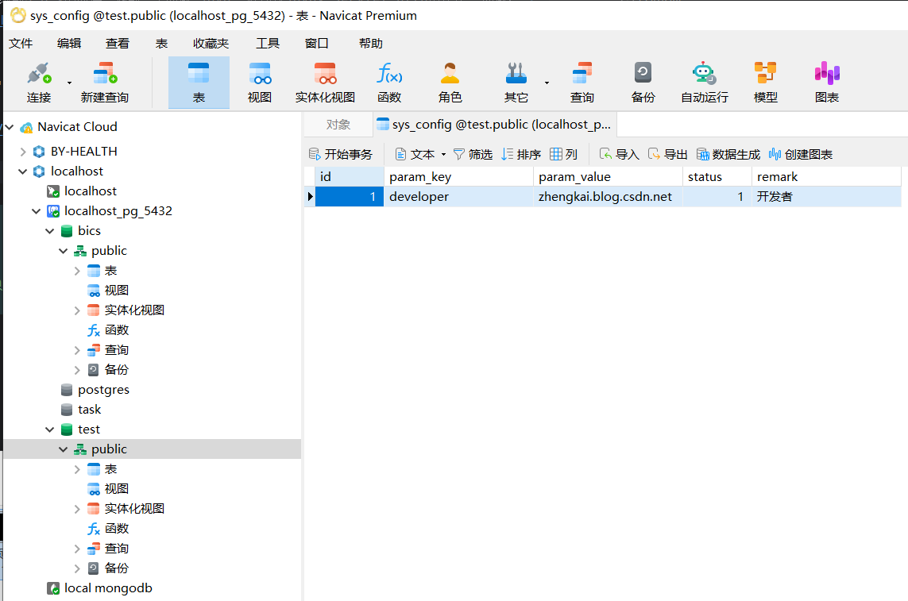
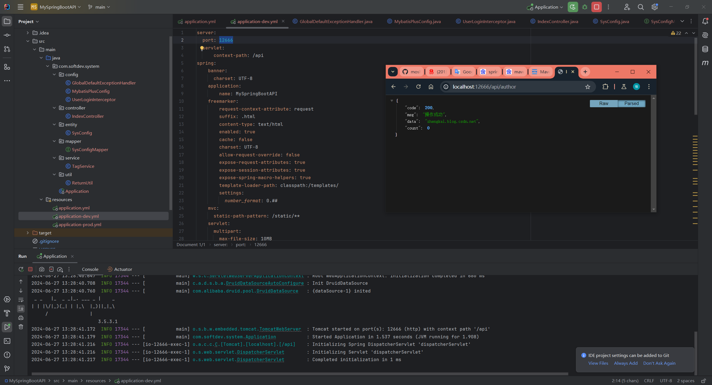

# MySpringBootAPI
----
SpringBoot脚手架，基于SpringBoot+Druid+PgSQL+MyBatisPlus+FastJSON+Lombok，其他的请自行添加和配置。

# Author
>powered by `Moshow郑锴(大狼狗)` , [https://zhengkai.blog.csdn.net](https://zhengkai.blog.csdn.net)

# 如何运行
1.首先确保你是JDK17，推荐微软的MSJDK17
2.使用Maven安装类库，国内推荐使用阿里云Maven镜像，`mvn clean compile`
3.使用比较新版本的PostgreSQL，作者本地为V16
4.项目已配置新版的SpringBoot2.6X，后续会升级
5.导入`D:\Workspace\Project\MySpringBootAPI\src\main\resources\SQL\public.sql`到你的数据库去，新建一个叫TEST的空白数据库，编码UTF8
6.找到Application，运行项目

# Upgrade Issue Resolution 升级问题解决方案
- 如果你最近也在升级FastJson到FastJson2版本，而跟我一样也遇到了FastJsonHttpMessageConverter找不到类问题以及FastJsonConfig找不到问题，那么恭喜你，看完本文，安装完fastjson2、fastjson2-extension、fastjson2-extension-spring6这三个类库，你就可以成功使用新版FastJson2了。
 [FastJson2中FastJsonHttpMessageConverter找不到类问题](https://blog.csdn.net/moshowgame/article/details/138013669)

- 当项目从2.7.x的springboot升级到3.0.x的时候，遇到一个问题“java: 程序包javax.servlet.http不存在” 问题：
 [java: 程序包javax.servlet.http不存在](https://zhengkai.blog.csdn.net/article/details/131362304)

# 运行效果




```shell
D:\Software\jdk\msjdk17\bin\java.exe -XX:TieredStopAtLevel=1 -Dspring.output.ansi.enabled=always -Dcom.sun.management.jmxremote -Dspring.jmx.enabled=true -Dspring.liveBeansView.mbeanDomain -Dspring.application.admin.enabled=true "-Dmanagement.endpoints.jmx.exposure.include=*" "-javaagent:D:\Software\IntelliJ IDEA\lib\idea_rt.jar=51271:D:\Software\IntelliJ IDEA\bin" -Dfile.encoding=UTF-8 -classpath D:\Workspace\Project\MySpringBootAPI\target\classes;C:\Users\Administrator\.m2\repository\org\projectlombok\lombok\1.18.24\lombok-1.18.24.jar;C:\Users\Administrator\.m2\repository\org\springframework\boot\spring-boot-starter-web\2.7.8\spring-boot-starter-web-2.7.8.jar;C:\Users\Administrator\.m2\repository\org\springframework\boot\spring-boot-starter\2.7.8\spring-boot-starter-2.7.8.jar;C:\Users\Administrator\.m2\repository\org\springframework\boot\spring-boot\2.7.8\spring-boot-2.7.8.jar;C:\Users\Administrator\.m2\repository\org\springframework\boot\spring-boot-starter-logging\2.7.8\spring-boot-starter-logging-2.7.8.jar;C:\Users\Administrator\.m2\repository\ch\qos\logback\logback-classic\1.2.11\logback-classic-1.2.11.jar;C:\Users\Administrator\.m2\repository\ch\qos\logback\logback-core\1.2.11\logback-core-1.2.11.jar;C:\Users\Administrator\.m2\repository\org\apache\logging\log4j\log4j-to-slf4j\2.17.2\log4j-to-slf4j-2.17.2.jar;C:\Users\Administrator\.m2\repository\org\apache\logging\log4j\log4j-api\2.17.2\log4j-api-2.17.2.jar;C:\Users\Administrator\.m2\repository\org\slf4j\jul-to-slf4j\1.7.36\jul-to-slf4j-1.7.36.jar;C:\Users\Administrator\.m2\repository\jakarta\annotation\jakarta.annotation-api\1.3.5\jakarta.annotation-api-1.3.5.jar;C:\Users\Administrator\.m2\repository\org\yaml\snakeyaml\1.30\snakeyaml-1.30.jar;C:\Users\Administrator\.m2\repository\org\springframework\boot\spring-boot-starter-tomcat\2.7.8\spring-boot-starter-tomcat-2.7.8.jar;C:\Users\Administrator\.m2\repository\org\apache\tomcat\embed\tomcat-embed-core\9.0.71\tomcat-embed-core-9.0.71.jar;C:\Users\Administrator\.m2\repository\org\apache\tomcat\embed\tomcat-embed-el\9.0.71\tomcat-embed-el-9.0.71.jar;C:\Users\Administrator\.m2\repository\org\apache\tomcat\embed\tomcat-embed-websocket\9.0.71\tomcat-embed-websocket-9.0.71.jar;C:\Users\Administrator\.m2\repository\org\springframework\spring-web\5.3.25\spring-web-5.3.25.jar;C:\Users\Administrator\.m2\repository\org\springframework\spring-webmvc\5.3.25\spring-webmvc-5.3.25.jar;C:\Users\Administrator\.m2\repository\com\alibaba\druid-spring-boot-starter\1.2.15\druid-spring-boot-starter-1.2.15.jar;C:\Users\Administrator\.m2\repository\com\alibaba\druid\1.2.15\druid-1.2.15.jar;C:\Users\Administrator\.m2\repository\org\slf4j\slf4j-api\1.7.36\slf4j-api-1.7.36.jar;C:\Users\Administrator\.m2\repository\org\springframework\boot\spring-boot-autoconfigure\2.7.8\spring-boot-autoconfigure-2.7.8.jar;C:\Users\Administrator\.m2\repository\org\postgresql\postgresql\42.3.10\postgresql-42.3.10.jar;C:\Users\Administrator\.m2\repository\org\checkerframework\checker-qual\3.5.0\checker-qual-3.5.0.jar;C:\Users\Administrator\.m2\repository\cn\hutool\hutool-all\5.8.28\hutool-all-5.8.28.jar;C:\Users\Administrator\.m2\repository\org\apache\commons\commons-lang3\3.14.0\commons-lang3-3.14.0.jar;C:\Users\Administrator\.m2\repository\org\springframework\boot\spring-boot-starter-json\2.7.8\spring-boot-starter-json-2.7.8.jar;C:\Users\Administrator\.m2\repository\com\fasterxml\jackson\core\jackson-databind\2.13.4.2\jackson-databind-2.13.4.2.jar;C:\Users\Administrator\.m2\repository\com\fasterxml\jackson\core\jackson-annotations\2.13.4\jackson-annotations-2.13.4.jar;C:\Users\Administrator\.m2\repository\com\fasterxml\jackson\core\jackson-core\2.13.4\jackson-core-2.13.4.jar;C:\Users\Administrator\.m2\repository\com\fasterxml\jackson\datatype\jackson-datatype-jdk8\2.13.4\jackson-datatype-jdk8-2.13.4.jar;C:\Users\Administrator\.m2\repository\com\fasterxml\jackson\datatype\jackson-datatype-jsr310\2.13.4\jackson-datatype-jsr310-2.13.4.jar;C:\Users\Administrator\.m2\repository\com\fasterxml\jackson\module\jackson-module-parameter-names\2.13.4\jackson-module-parameter-names-2.13.4.jar;C:\Users\Administrator\.m2\repository\org\springframework\spring-context\5.3.25\spring-context-5.3.25.jar;C:\Users\Administrator\.m2\repository\org\springframework\spring-aop\5.3.25\spring-aop-5.3.25.jar;C:\Users\Administrator\.m2\repository\org\springframework\spring-beans\5.3.25\spring-beans-5.3.25.jar;C:\Users\Administrator\.m2\repository\org\springframework\spring-core\5.3.25\spring-core-5.3.25.jar;C:\Users\Administrator\.m2\repository\org\springframework\spring-jcl\5.3.25\spring-jcl-5.3.25.jar;C:\Users\Administrator\.m2\repository\org\springframework\spring-expression\5.3.25\spring-expression-5.3.25.jar;C:\Users\Administrator\.m2\repository\org\springframework\spring-jdbc\5.3.25\spring-jdbc-5.3.25.jar;C:\Users\Administrator\.m2\repository\org\springframework\spring-tx\5.3.25\spring-tx-5.3.25.jar;C:\Users\Administrator\.m2\repository\org\apache\commons\commons-dbcp2\2.5.0\commons-dbcp2-2.5.0.jar;C:\Users\Administrator\.m2\repository\org\apache\commons\commons-pool2\2.11.1\commons-pool2-2.11.1.jar;C:\Users\Administrator\.m2\repository\junit\junit\4.13.1\junit-4.13.1.jar;C:\Users\Administrator\.m2\repository\org\hamcrest\hamcrest-core\2.2\hamcrest-core-2.2.jar;C:\Users\Administrator\.m2\repository\org\hamcrest\hamcrest\2.2\hamcrest-2.2.jar;C:\Users\Administrator\.m2\repository\com\baomidou\mybatis-plus-boot-starter\3.5.3.1\mybatis-plus-boot-starter-3.5.3.1.jar;C:\Users\Administrator\.m2\repository\com\baomidou\mybatis-plus\3.5.3.1\mybatis-plus-3.5.3.1.jar;C:\Users\Administrator\.m2\repository\com\baomidou\mybatis-plus-extension\3.5.3.1\mybatis-plus-extension-3.5.3.1.jar;C:\Users\Administrator\.m2\repository\com\baomidou\mybatis-plus-core\3.5.3.1\mybatis-plus-core-3.5.3.1.jar;C:\Users\Administrator\.m2\repository\com\baomidou\mybatis-plus-annotation\3.5.3.1\mybatis-plus-annotation-3.5.3.1.jar;C:\Users\Administrator\.m2\repository\com\github\jsqlparser\jsqlparser\4.4\jsqlparser-4.4.jar;C:\Users\Administrator\.m2\repository\org\mybatis\mybatis\3.5.10\mybatis-3.5.10.jar;C:\Users\Administrator\.m2\repository\org\mybatis\mybatis-spring\2.0.7\mybatis-spring-2.0.7.jar;C:\Users\Administrator\.m2\repository\org\springframework\boot\spring-boot-starter-jdbc\2.7.8\spring-boot-starter-jdbc-2.7.8.jar;C:\Users\Administrator\.m2\repository\com\zaxxer\HikariCP\4.0.3\HikariCP-4.0.3.jar;C:\Users\Administrator\.m2\repository\com\baomidou\mybatis-plus-generator\3.5.3.1\mybatis-plus-generator-3.5.3.1.jar com.softdev.system.Application

  .   ____          _            __ _ _
 /\\ / ___'_ __ _ _(_)_ __  __ _ \ \ \ \
( ( )\___ | '_ | '_| | '_ \/ _` | \ \ \ \
 \\/  ___)| |_)| | | | | || (_| |  ) ) ) )
  '  |____| .__|_| |_|_| |_\__, | / / / /
 =========|_|==============|___/=/_/_/_/
 :: Spring Boot ::                (v2.7.8)

2024-06-27 13:42:04.817  INFO 2104 --- [           main] com.softdev.system.Application           : Starting Application using Java 17.0.11 on DEEP-2024FMTDWA with PID 2104 (D:\Workspace\Project\MySpringBootAPI\target\classes started by Administrator in D:\Workspace\Project\MySpringBootAPI)
2024-06-27 13:42:04.819  INFO 2104 --- [           main] com.softdev.system.Application           : The following 1 profile is active: "dev"
2024-06-27 13:42:05.438  INFO 2104 --- [           main] o.s.b.w.embedded.tomcat.TomcatWebServer  : Tomcat initialized with port(s): 12666 (http)
2024-06-27 13:42:05.444  INFO 2104 --- [           main] o.apache.catalina.core.StandardService   : Starting service [Tomcat]
2024-06-27 13:42:05.445  INFO 2104 --- [           main] org.apache.catalina.core.StandardEngine  : Starting Servlet engine: [Apache Tomcat/9.0.71]
2024-06-27 13:42:05.513  INFO 2104 --- [           main] o.a.c.c.C.[Tomcat].[localhost].[/api]    : Initializing Spring embedded WebApplicationContext
2024-06-27 13:42:05.513  INFO 2104 --- [           main] w.s.c.ServletWebServerApplicationContext : Root WebApplicationContext: initialization completed in 665 ms
2024-06-27 13:42:05.571  INFO 2104 --- [           main] c.a.d.s.b.a.DruidDataSourceAutoConfigure : Init DruidDataSource
2024-06-27 13:42:05.624  INFO 2104 --- [           main] com.alibaba.druid.pool.DruidDataSource   : {dataSource-1} inited
 _ _   |_  _ _|_. ___ _ |    _ 
| | |\/|_)(_| | |_\  |_)||_|_\ 
     /               |         
                        3.5.3.1 
2024-06-27 13:42:06.012  INFO 2104 --- [           main] o.s.b.w.embedded.tomcat.TomcatWebServer  : Tomcat started on port(s): 12666 (http) with context path '/api'
2024-06-27 13:42:06.019  INFO 2104 --- [           main] com.softdev.system.Application           : Started Application in 1.475 seconds (JVM running for 1.852)

```

访问`http://localhost:12666/api/author`

返回报文
```json
{
"code": 200,
"msg": "操作成功",
"data": "zhengkai.blog.csdn.net",
"count": 0
}
```

# 版本更新

| 日期         | 内容        |
|------------|-----------|
| 2024-06-27 | 初始化2.6X版本 |